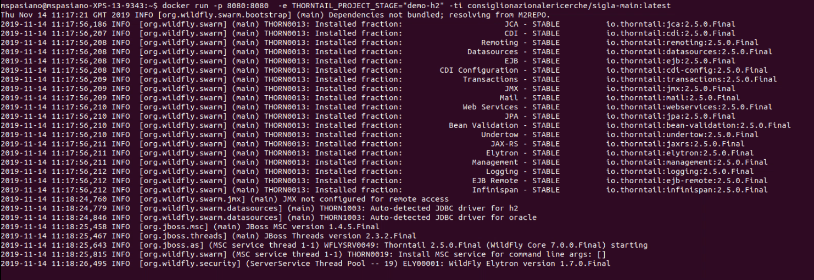

# [](https://contab.cnr.it/SIGLANG)

[](https://github.com/consiglionazionaledellericerche/sigla-main/blob/master/LICENSE)
[](https://openjdk.java.net/install/)
[](https://mvnrepository.com/artifact/it.cnr.si.sigla/sigla-parent)
[](https://github.com/consiglionazionaledellericerche/sigla-main/contributors/)
[](https://hub.docker.com/r/consiglionazionalericerche/sigla-main/)
[](https://hub.docker.com/r/consiglionazionalericerche/sigla-main/)

[](https://app.circleci.com/pipelines/github/consiglionazionaledellericerche/sigla-main)
[](https://consiglionazionaledellericerche.github.io/sigla-main)

## MAVEN dependency
|Artifact| Version |
|---|---|
|[thorntail.io](https://thorntail.io/)| |
|[Spring.io](https://spring.io/)|  |
|[Liquibase](https://www.liquibase.org/) | |
|[SIOPE+](https://github.com/consiglionazionaledellericerche/siopeplus) | |
|[Storage Cloud](https://github.com/consiglionazionaledellericerche/storage-cloud) | |
|[JADA JEE Framework](https://github.com/consiglionazionaledellericerche/jada) | |
 
## Introduzione
Al fine di fornire elementi generali della Soluzione applicativa, evidenziamo informazioni di sintesi sul Sistema Contabile SIGLA, di proprietà del CNR, che si occupa di processi amministrativi e contabili, di previsione, gestione e di rendicontazione. Il Sistema si rivolge ad Enti pubblici, in particolare Enti di ricerca, che operano in regime di Contabilità Finanziaria, con obbligo di adozione, in aggiunta, del sistema di contabilità basato su rilevazione dei fatti di gestione in termini economici, patrimoniali ed analitici.

## Premessa
L'attività di progettazione e sviluppo dell'applicazione è stata avviata nel 2001 quando emerse per il CNR la necessità di dotarsi di un nuovo sistema integrato per la gestione della contabilità, in attuazione del Regolamento di disciplina dell'amministrazione e dell'attività contrattuale del CNR, approvato con DPCNR n. 015448 del 14/01/2000, ispirato ai nuovi principi di contabilità pubblica introdotti dalla legge 94/97 e dal Decreto legislativo 279/97.
Una significativa revisione dell'impianto dell'applicazione è stata operata durante il 2004, in attuazione del decreto legislativo n. 127 del 4/06/2003, al fine di migliorare il controllo di gestione delle risorse ed allineare la gestione contabile interna ai criteri di rendicontazione dei progetti (con particolare riferimento a progetti europei e nazionali).
Ad oggi il sistema informativo SIGLA risulta completamente coerente ed adattabile all’impostazione dei bilanci ed alla gestione delle attività previste dalla normativa vigente in materia di contabilità pubblica.

## Informazioni generali del Sistema 
Il **S**istema **I**ntegrato per la **G**estione delle **L**inee di **A**ttività è un sistema applicativo modulare, organizzato in componenti funzionali integrate tra loro e gestibili autonomamente l’una dall’altra.

**L’accesso** al sistema, anche tramite web, ai dati e alle funzionalità, è controllato da parte degli amministratori del sistema attraverso la definizione di profili utente che limitano la visibilità e l’utilizzo delle funzioni, nonché la gestione di alcuni dati o l’utilizzo di particolari funzionalità. L’accesso all’applicazione è veicolato anche alla struttura organizzativa dell’Ente a cui si è abilitati.
La soluzione applicativa è ‘Multiente’ e si articola su tre livelli di organizzazione dell’Ente, che nel caso specifico del CNR, sono:
    • Centro di Spesa;
    • Unità Organizzativa;
    • Centro di Responsabilità.

**L’architettura** e la tecnologia utilizzate nello sviluppo consentono una facile manutenzione ed evoluzione del sistema. La possibilità di utilizzare o implementare servizi a supporto delle integrazioni, semplifica il dialogo dell’applicazione stessa con altre applicazioni all’interno dell’Ente e consente di poter utilizzare solo alcune componenti SIGLA, sostituendone alcune con quelle eventualmente già presenti nella realtà di interesse. La documentazione e l’help online previsti completano la semplice usabilità dell’applicativo.
Le interfacce semplici e intuitive dell’applicazione aiutano l’utente ad orientarsi nei vari processi funzionali previsti.

**Sigla** copre diversi aspetti amministrativi e di gestione contabile, e pone alla base di tutti i processi funzionali il controllo dell’uso delle risorse a supporto dell’attività di ricerca, o di una qualsiasi attività pubblica progettuale. L’elemento trasversale alle varie funzionalità è infatti rappresentato dal Progetto articolato in linee di attività.
Organizzato in questo modo il sistema prevede gestisce e controlla l’aspetto analitico, a partire dalla fase di previsione fino alla completa rendicontazione, del Bilancio contabile.

**La possibilità** di estrarre in excel tutti i dati presenti sulle funzioni di consultazione e di produrre report in autonomia, rappresenta una grande utilità per gli utenti che organizzano il proprio lavoro in maniera semplice ed autonoma. Così come la possibilità di schedulare report periodici e di farli recapitare automaticamente al proprio indirizzo mail o a quello di altri collaboratori.

## Componenti Funzionali SIGLA 

Le componenti funzionali del Sistema coprono aspetti contabili e aspetti amministrativo-contabili che forniscono automaticamente risultati contabili. Gli argomenti possono essere raggruppati come di seguito indicato e si articolano, chiaramente, in gestioni e funzionalità di dettaglio:

    • Gestione delle utenze e degli aspetti di configurazione del Sistema
        ◦ Amministrazione dei Profili e delle Abilitazioni;
        ◦ Definizione Struttura organizzativa dell’Ente;
        ◦ Configurazione del sistema.

    • Gestione delle Anagrafiche fondamentali
        ◦ Progetti e GAE (gestione azioni elementari);
        ◦ Anagrafica Terzi;
        ◦ Piano dei Conti Finanziario ed Economico;
        ◦ Anagrafiche di base.

    • Gestione della Programmazione Economica e Finanziaria
        ◦ Bilancio di previsione Decisionale/Gestionale;
        ◦ Variazioni e Storni di Bilancio.

    • Gestione contabile;
        ◦ Impegni e Accertamenti;
        ◦ Mandati, Reversali e interfaccia Cassiere;
        ◦ Documenti Amministrativi;
        ◦ Gestione IVA.

    • Gestioni consuntive;
        ◦ Gestione delle rendicontazioni analitiche;
        ◦ Bilancio economico;
        ◦ Operazioni di fine anno.

    • Gestione delle Missioni;
    • Gestione degli Incarichi di collaborazione;
    • Gestione dell’Inventario.

## Applicazioni on line

* [SIGLA - CNR](https://contab.cnr.it/SIGLANG)
* [SIGLA - ISIN](https://isin.cnr.it)

## 👏 Come Contribuire 

Lo scopo principale di questo repository è continuare ad evolvere SIGLA. Vogliamo contribuire a questo progetto nel modo più semplice e trasparente possibile e siamo grati alla comunità per ogni contribuito a correggere bug e miglioramenti.

## 📄 Licenza

SIGLA è concesso in licenza GNU AFFERO GENERAL PUBLIC LICENSE, come si trova nel file [LICENSE][l].

[l]: https://github.com/consiglionazionaledellericerche/cool-jconon/blob/master/LICENSE

#  Startup

#### _Per avviare una istanza di SIGLA con h2 in memoria_ 
```
docker run -p 8080:8080  -e THORNTAIL_PROJECT_STAGE="demo-h2" -ti consiglionazionalericerche/sigla-main:latest
```



#### _Per avviare una istanza di SIGLA con oracle locale_ 
```
git clone git@github.com:consiglionazionaledellericerche/sigla-main.git
cd sigla-main
docker run -d --name sigla-oracle -v $PWD/sigla-backend/initdb-oracle:/etc/entrypoint-initdb.d orangehrm/oracle-xe-11g
docker run -p 8080:8080 --link sigla-oracle:db -e LC_ALL="it_IT.UTF-8" -e LANG="it_IT.UTF-8" -e LANGUAGE="it_IT:it" -e THORNTAIL_DATASOURCES_DATA-SOURCES_SIGLA_CONNECTION-URL="jdbc:oracle:thin:@db:1521:xe" -e THORNTAIL_PROJECT_STAGE="demo-oracle" -ti consiglionazionalericerche/sigla-main:latest
```
#### _Per avviare una istanza di SIGLA con postgres locale_
```
git clone git@github.com:consiglionazionaledellericerche/sigla-main.git
cd sigla-main
docker run --name sigla-postgres -v $PWD/sigla-backend/init-user-postgres-db.sh:/docker-entrypoint-initdb.d/init-user-db.sh -e POSTGRES_PASSWORD=mysecretpassword -d postgres:9.6
docker run -p 8080:8080 --link sigla-postgres:db -e LC_ALL="it_IT.UTF-8" -e LANG="it_IT.UTF-8" -e LANGUAGE="it_IT:it" -e THORNTAIL_DATASOURCES_DATA-SOURCES_SIGLA_CONNECTION-URL="jdbc:postgresql://db:5432/sigladb?schema=public" -e THORNTAIL_PROJECT_STAGE="demo-postgres" -ti consiglionazionalericerche/sigla-main:latest
```

Collegarsi a http://localhost:8080/SIGLA/Login.do username: _ENTE_ password da impostare al primo login. 
FINE
