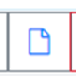

Folder: “Allegati”
==================

Il folder consente di allegare le varie tipologie di documenti che vengono richiesti in maniera obbligatoria dalla procedura.

“Tipologia del file archiviato”: è il tipo di contenuto del file che si sta allegando. Le tipologie dei file non dovranno più essere scelte utilizzando il menù a tendina bensì selezionando l’apposito bottone:

-  **- “Avviso da pubblicare”** : è obbligatorio solo nel caso il cui sia prevista la procedura comparativa; tale file sarà pubblicato sul sito del CNR insieme ad una breve descrizione dell’avviso per il conferimento di un incarico;

 
- **- “Allegato generico”**: è un allegato generico, non obbligatorio, che il soggetto ritiene opportuno allegare all’incarico:

- **“Contratto Stipulato”**: è un allegato obbligatorio qualsiasi sia la procedura amministrativa utilizzata.

- **“Decisione a contrattare”**: è un allegato obbligatorio qualsiasi sia la procedura amministrativa utilizzata.
   
- **“Esito controllo Corte dei Conti”** : è un allegato non più richiesto dalla normativa vigente.

Dopo avere selezionato la tipologia del file da archiviare “Sfoglia”: apre la modalità di selezione file di Windows per ricercare i
documenti da allegare.

“Descrizione del File”: è un campo testuale non obbligatorio.

“Apri File”: consente di aprire o salvare il file dopo averlo allegato.

**Ai fini della pubblicazione sul sito Internet istituzionale del CNR si raccomanda di usare file in formato PDF e di controllare sempre, dopo il salvataggio, la leggibilità dell’allegato utilizzando il bottone “Apri file”.**

Nel caso in cui sia stato allegato un documento non corretto è possibile cancellarlo se non è stato ancora salvato. In caso contrario, è possibile eliminare solo logicamente il documento.

Per eliminare o annullare un documento è necessario selezionare la riga e cliccare sull’icona del cestino posizionata in basso a sinistra del riquadro degli allegati.

Tale funzione **non è possibile per i documenti che sono stati pubblicati** e quindi la modifica dei documenti è consentita fino a quando l’incarico non diventa definitivo.

**Folder: “Variazioni”**

Il folder delle variazioni è visibile solo per gli incarichi che risultano in stato “definitivo”.
Esistono due tipologie di variazioni, una per adeguare il contratto alla durata del progetto nel periodo transitorio e l’altra per gestire gli incrementi delle aliquote previdenziali e assicurative.

