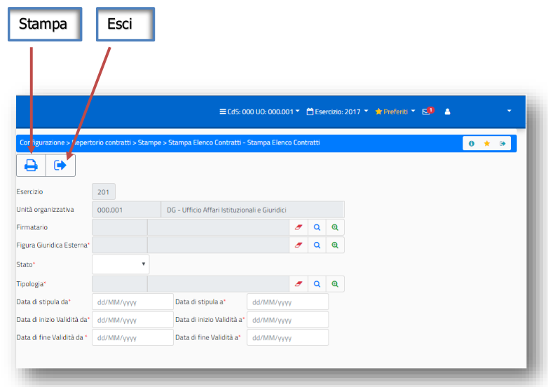
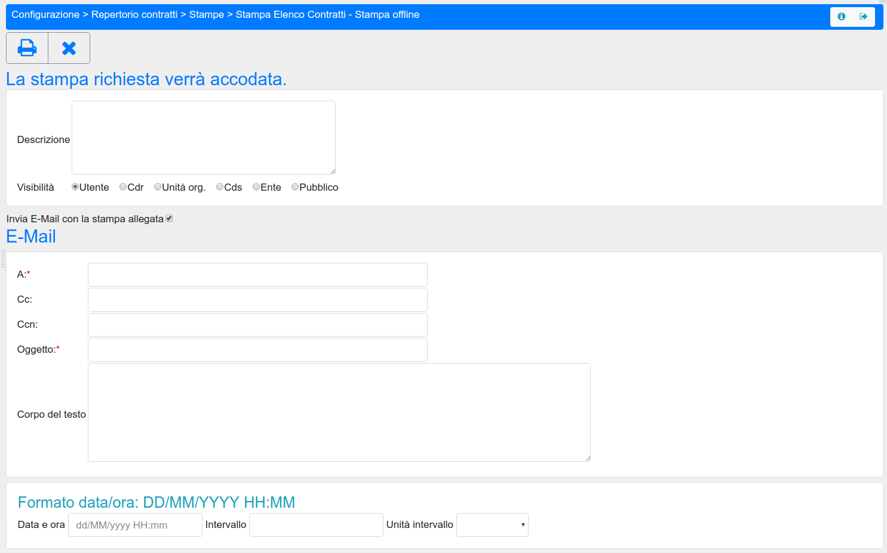
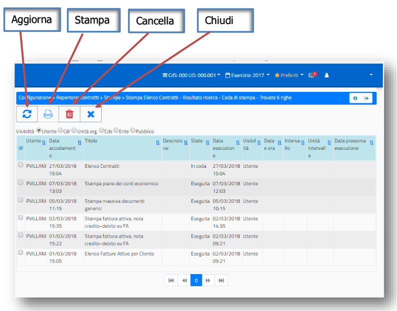

# Coda di Stampa

Le mappe di lancio stampa si presentano con le seguenti icone:

Successivamente al lancio della stampa è possibile inserire una descrizione e cambiare la visibilità della stampa eseguita:

- Utente (**default**)
- Cdr
- Unità Organizzativa
- CdS
- Ente
- Pubblico 

Inoltre attivando la spunta su **Invia E-Mail con la stampa allegata** è possibile ricevere via E-mail il contenuto della stampa,
inoltre è possibile schedulare la produzione della stampa stessa secondo i parametri presenti nella maschera.

E il riporto nella mappa della coda di stampe:

