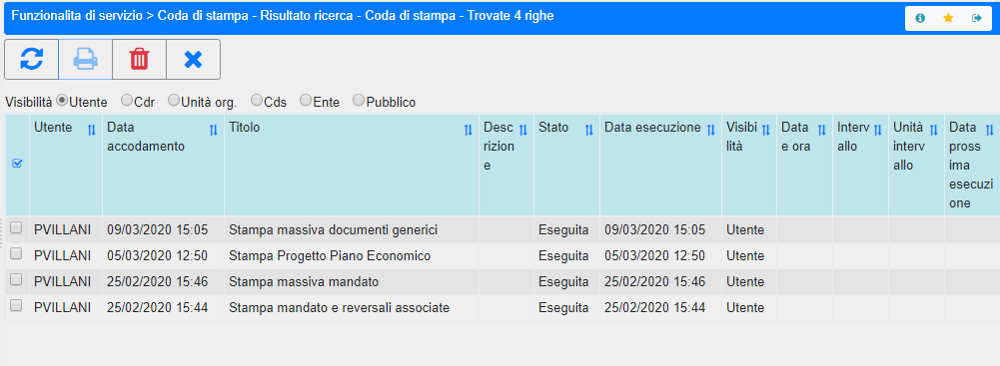

.. _coda-di-stampa:

==============
Coda di Stampa
==============

La funzionalità mostra la Coda di Stampa che riporta tutti gli elaborati visibili per l'utente di accesso:

- Elaborati eseguiti;
- Elaborati in coda;
- Eventualmente anche elaborati non completati per il verificarsi di errori.

Questa mappa è presente a menù e potrebbe essere consultata dall'utente all'occorrenza. In ogni caso automaticamente la funzione viene presentata all'utente anche quando chiede ed accetta l'accodamento delle stampa e da qui è possibile verificare lo stato delle schedulazioni avviate. Sempre in questa funzione è possibile eliminare elaborati eseguiti e non più utili.

