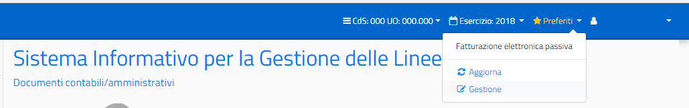

==================
Gestione Preferiti
==================

La lista dei preferiti è alimentata liberamente dall’utente durante la navigazione all’interno delle funzionalità:

.. figure:: ../screenshot/navbar_2.png

La lista dei preferiti è sempre disponibile nella barra delle applicazioni. L’utente può spostarsi in qualsiasi momento in una delle funzionalità della lista.

E’ possibile inoltre gestire i preferiti, accedendo alla lista, ed entrando nella relativa
gestione:

La gestione dei preferiti consente di eliminare e/o aggiungere funzioni alla lista ed eventualmente modificare le informazioni inserite in fase di aggiunta della funzione tra i preferiti:

.. figure:: ../screenshot/bookmark.png

Per poter accedere alla ‘Gestione Preferiti’ occorre che l’utente abbia l’abilitazione alla funzione (Abilitazione da aggiungere da parte del gestore delle utenze).
L’aggiornamento dei preferiti, invece, serve per applicare le modifiche (aggiunta o eliminazione) alla lista dei preferiti.