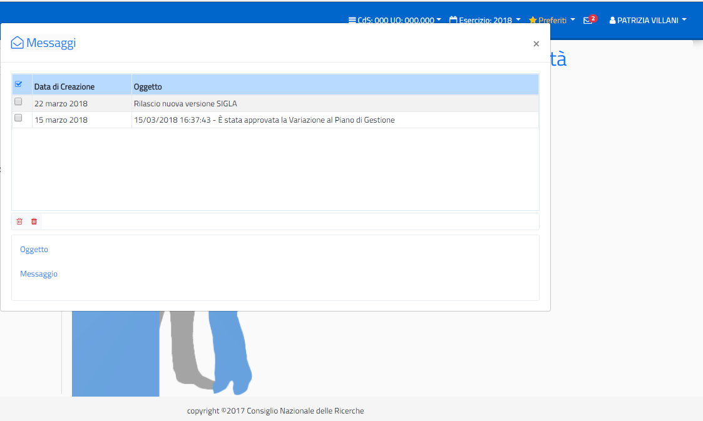

====================
Messaggi Applicativi
====================

La ‘Gestione dei Messaggi’ qui trattata si riferisce esclusivamente ad Avvisi, di natura
tecnica o contabile, che si ritengono importanti per l’utenza, e che quindi vanno
proposti durante l’accesso all’applicazione, senza riferimento a funzionalità o errori
specifici dell’applicazione. Non vanno confusi, quindi, con i messaggi di errore o alert
applicativi gestiti all’interno delle singole funzionalità.

La messaggistica di cui si sta parlando, di tipo ‘Avviso’, si riferisce a due tipi di
messaggio:
- Messaggi dell’applicazione che informano l’utente su fatti contabili di loro competenza;
- Messaggi di avviso per attività tecniche da operare su Sigla (da parte dell’helpdesk Sigla).

In entrambi i casi, nel momento in cui ci fossero messaggi di interesse per l’utente,
all’accesso in SIGLA viene evidenziato sulla barra delle applicazioni l’icona della
‘letterina’ con il numero di messaggi da leggere. Cliccando sull’icona vengono mostrati i messaggi:

Il primo messaggio è stato configurato in modo da restare in ‘cassetta postale’ fino ad
una certa scadenza e quindi non sarà possibile per l’utente eliminarlo fino alla scadenza
programmata.

Il secondo messaggio, invece, non avendo nessuna scadenza programmata perché si
tratta di un ‘avviso’, può essere selezionato e cancellato dall’utente dopo la lettura. In
questo ultimo caso resta a scelta dell’utente se tenere il messaggio come promemoria
oppure cancellarlo subito dopo la lettura.