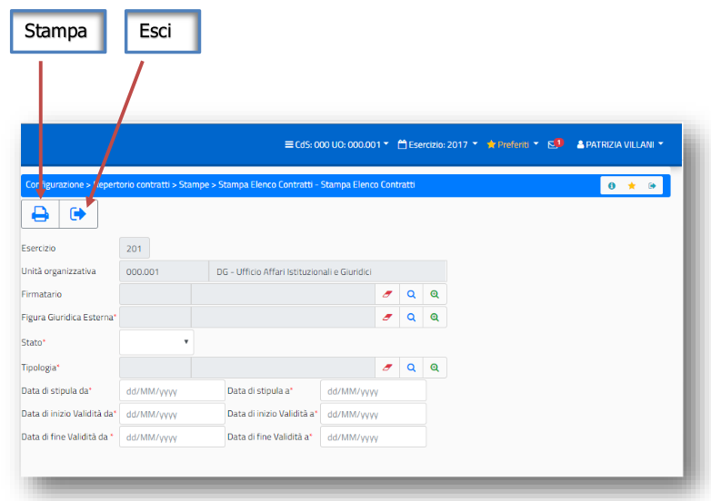
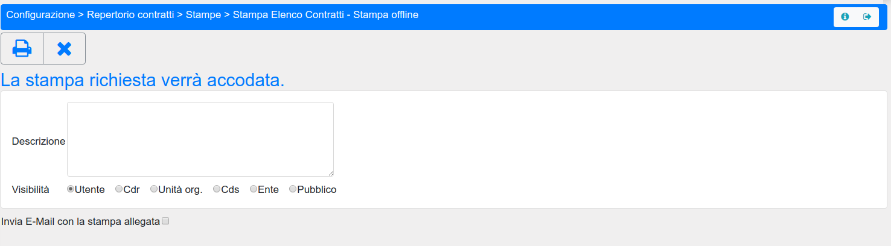
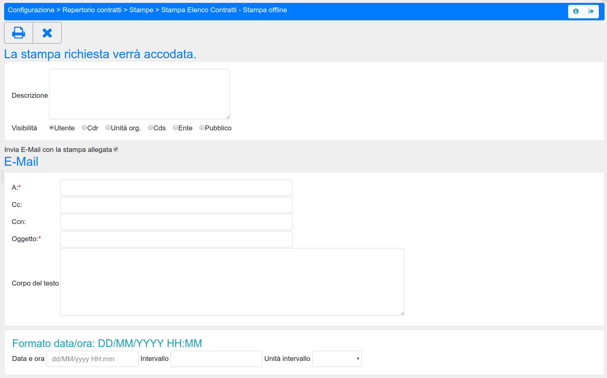

.. stampe:

===============
Gestione Stampe
===============

In Sigla ci sono fondamentalmente due tipologie di stampe:

- Stampe predefinite
- Stampe automatiche

Le stampe **predefinite** sono quelle previste dalla procedura Sigla, preimpostate per quanto riguarda gli schemi di stampa e i contenuti. Queste sono prodotte sempre in formato pdf e si presentano a menù sotto la voce 'Stampe'.

Le stampe **automatiche** sono quelle che possono essere prodotte a partire da tutte le funzioni di consultazione (o di gestione in cui è prevista la ricerca con risultati in griglia) per le quali è possibile effettuare stampe in formato pdf oppure estrazione dei dati in file excel. 
Queste stampe rappresentano una utility importante perchè rendono possibile la produzione immedita di un file pdf che riporta i contenuti della ricerca in griglia dopo l'applicazione di filtri di ricerca previsti dalle funzioni, oppure la produzione di un file excel (attraverso l'utilizzo della coda di stampa), utilizzabile dall'utente in maniera autonoma rispetto alle funzionalità di Sigla.

Sia le stampe predefinite che le estrazioni di file excel, utilizzano la coda di stampa per avviare l'elaborazione richiesta lasciando libero l'utente di operare su altre funzionalità di Sigla mentre viene prodotto l'elaborato.
Dopo aver richiesto le stampe, queste vengono inviate nella  :ref:`coda-di-stampa`, dandone messaggio all'utente.

Le mappe di lancio stampa si presentano con le seguenti icone:

Successivamente al lancio della stampa è possibile inserire una descrizione e cambiare la visibilità della stampa eseguita:

- Utente (**default**)
- Cdr
- Unità Organizzativa
- CdS
- Ente
- Pubblico 

Attivando la spunta su **Invia E-Mail con la stampa allegata** è possibile ricevere via E-mail il prodotto della stampa.
Inoltre è possibile schedulare la produzione della stampa stessa secondo i parametri presenti nella maschera.

Indicando nell'ultimo box una data/ora, una unità di intervallo (giorni/settimane/mesi) ed un **valore per l’unità di intervallo** (1 giorno, 5 giorni, 2 settimane, ecc.) si indica a SIGLA:
- di eseguire quella particolare stampa a partire da quella data/ora con la cadenza indicata;
- di inviarla automaticamente agli indirizzi e-mail indicati.

Tale funzionalità, naturalmente disponibile **per ogni stampa della procedura**, può essere utile nei casi in cui un utente richieda a SIGLA delle stampe con una certa regolarità oppure, cosa ancora più importante, nei casi in cui il destinatario finale della stampa non sia un utente corrente di SIGLA (p.e. ricercatori, direttori di istituto, ecc.).
Il destinatario della mail ha la possibilità di cancellarsi dalla lista di distribuzione della stampa attraverso un link presente nel corpo della mail.

Verrà fornito un messaggio che chiede conferma della volontà di rimuovere la casella di posta elettronica dalla lista di distribuzione. Se si prosegue verrà inviata una e-mail di notifica della cancellazione.
Inoltre, a seconda della **visibilità** conferita alla coda di stampa, l’utente che ha schedulato una stampa (oppure tutti gli utenti dello stesso CdR, della stessa U.O., ecc.) ha la possibilità di cancellare la coda di stampa eliminando di fatto la schedulazione della stessa.
