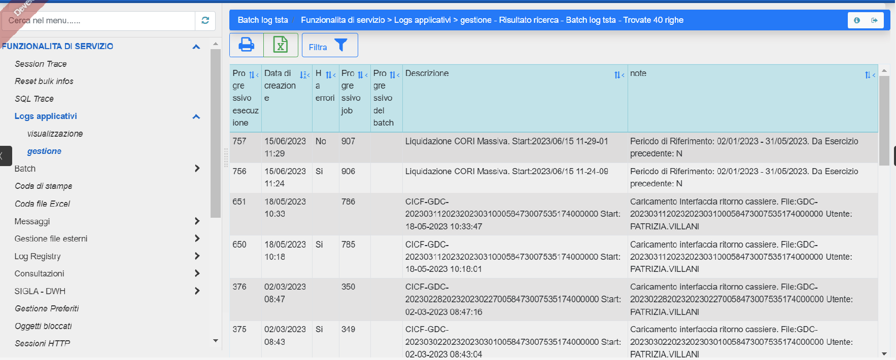
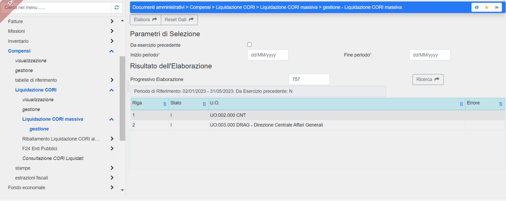
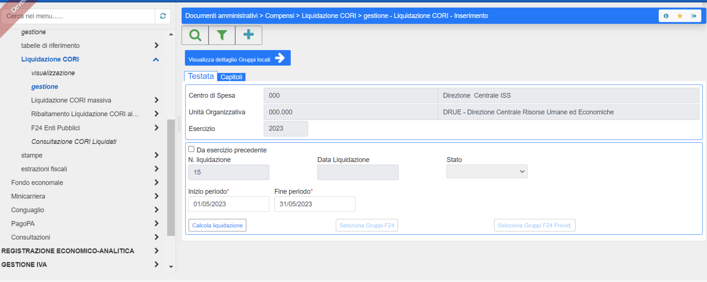
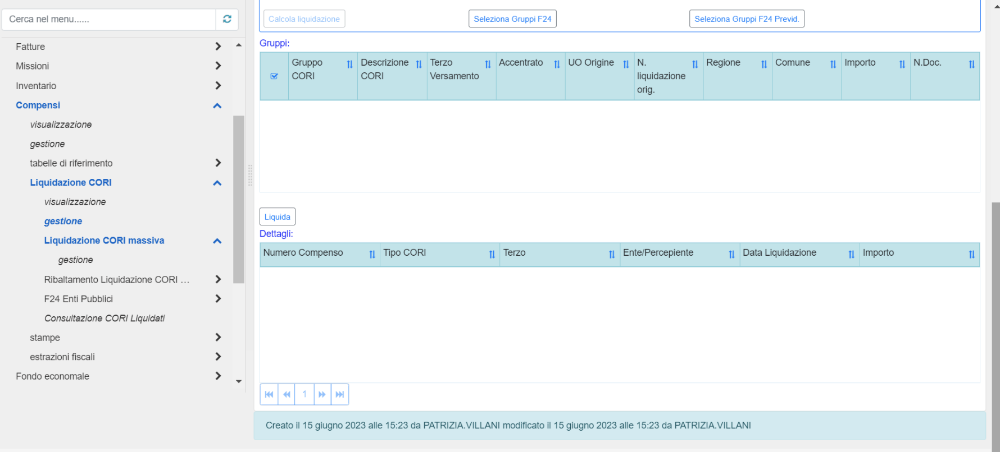
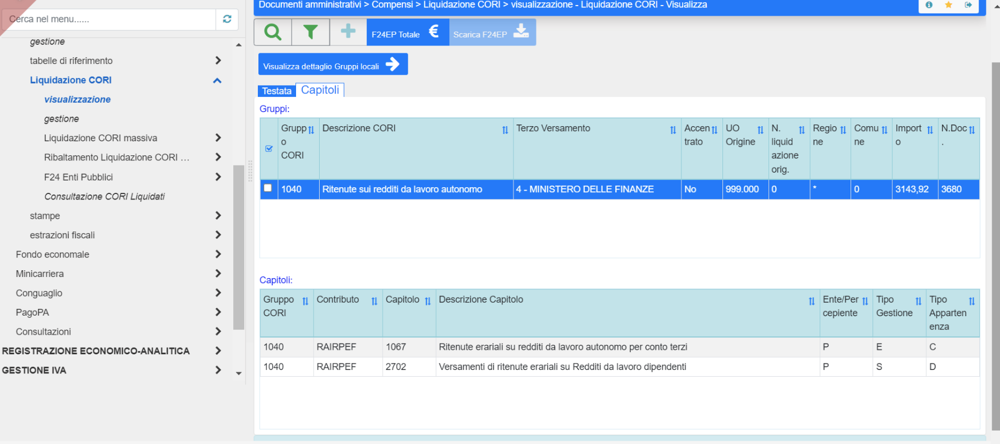
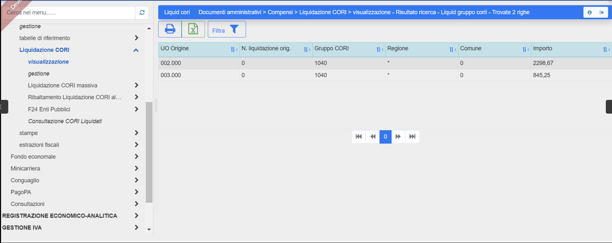

LIQUIDAZIONE CORI CENTRALIZZATA
===============================

Nelle configurazioni del sistema viene indicato il CDS/UO che accentra i
Contributi/Ritenute ed emette mandati di versamento.

Entrando quindi con la UO ‘Versante’ bisogna eseguire la funzione
‘Liquidazione CORI Massiva’. In questo modo vengono girate sulla UO
‘Versante’ le partite di giro per i tributi da ogni UO che ha tributi da
versare nel periodo indicato. Le partite di giro entrate sulle singole
UO diventano entrate tronche (viene azzerato l’impegno di spesa
corrispondente) e viene creata un’unica partita di giro Spesa Tronca
sulla UO ‘Versante’ come somma di tutti gli importi delle varie UO,
raggruppando per voce.

Tra i log applicativi viene generata l’elaborazione (che ha un
progressivo elaborazione) con i dettagli per CDS:

|Immagine che contiene testo, schermata, software, Icona del computer
Descrizione generata automaticamente|

Con questo progressivo si possono consultare i dettagli, sempre sulla
funzione Liquidazione CORI massiva, facendo la ricerca:

|Immagine che contiene testo, schermata, software, Icona del computer
Descrizione generata automaticamente|

Successivamente, sempre dalla UO Versante si utilizza la funzione
Liquidazione CORI per fare ‘Calcola liquidazione’:

|Immagine che contiene testo, schermata, software, Icona del computer
Descrizione generata automaticamente|

Vengono indicati i dettagli dei tributi che entrerebbero nel versamento.

e poi con il pulsante ‘Liquida’ si effettua l’emissione dei mandati:

|Immagine che contiene testo, schermata, software, Icona del computer
Descrizione generata automaticamente|

Con il Liquida vengono emessi i mandati raggruppati per guppo cori.

In Visualizzazione ‘Liquidazione CORI’ è possibile tramite la selezione
della liquidazione vedere i dettagli:

|Immagine che contiene testo, schermata, software, Icona del computer
Descrizione generata automaticamente|

E sulla Tab ‘capitoli’ è possibile consultare il mandato/i mandati
emessi, i terzi a cui sono andati i versamenti e i capitoli:

|Immagine che contiene testo, schermata, software, Icona del computer
Descrizione generata automaticamente|

La funzione in alto ‘Visualizza dettaglio Gruppi Locali’ mostra l’elenco
dei tributi liquidati (per la UO Versante tutti quelli liquidati anche
di altre UO, per le altre UO i tributi liquidati per la specifica UO):

|Immagine che contiene testo, schermata, software, Icona del computer
Descrizione generata automaticamente|

La Funzione ‘F24 Enti Pubblici’ (utilizzabile da chi è opportunamente
abilitato) consente di elaborare e scaricare il file F24:

|Immagine che contiene testo, schermata, software, Icona del computer
Descrizione generata automaticamente|

La funzione Consultazione CORI liquidati consente di consultare,
indicando il numero di mandato o il numero di liquidazione, il dettaglio
dei tributi inseriti nel versamento.

|Immagine che contiene testo, schermata, software, Icona del computer
Descrizione generata automaticamente|

.. |Immagine che contiene testo, schermata, software, Icona del computer Descrizione generata automaticamente| image:: ./media/image5.png
   :width: 6.69306in
   :height: 2.93056in

.. |Immagine che contiene testo, schermata, software, Icona del computer Descrizione generata automaticamente| image:: ./media/image8.png
   :width: 6.69306in
   :height: 3.25in

