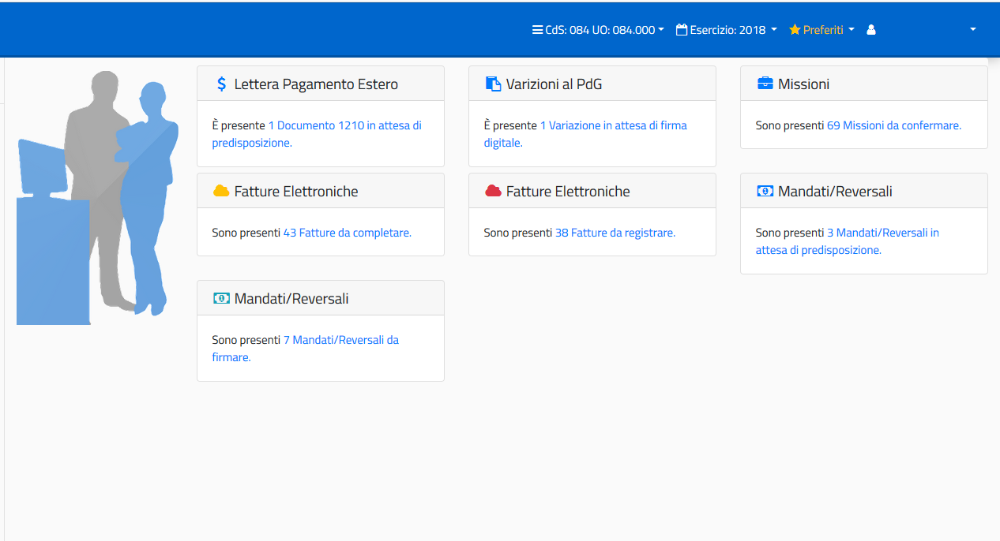

===========================
Indicazioni generali Layout
===========================

Obiettivo del presente documento è fornire le informazioni necessarie all’utilizzo dell'interfaccia per la procedura SIGLA. 
Saranno date indicazioni sulle modalità grafiche e di utilizzo rispetto a:

- Accesso all’applicazione e modifica dati di accesso all’interno dell’applicazione;
- Presentazione e Funzionalità per quanto riguarda il menù;
- Presentazione dell'interfaccia SIGLA e utilizzo dei vari componenti;

Premessa
========

La modifica delle caratteristiche di presentazione delle funzionalità di SIGLA non cambia in alcun modo i processi amministrativi previsti, né influenza dati e utilizzo degli stessi.

L’obiettivo della revisione dell’intero layout della procedura è esclusivamente quello di rendere più ‘usabile’ le funzionalità. In alcuni casi la revisione ha riguardato l’aggiunta di utilità importanti sempre al fine di migliorare la navigazione e la gestione delle mappe.

Accesso all’applicazione SIGLA
==============================

Tutto ciò che riguarda le credenziali di accesso, abilitazioni all’accesso da parte dell’amministratore delle Utenze e scadenza delle password, non è oggetto di modifica. Di seguito vengono indicate le nuove modalità di presentazione della mappa di accesso:

.. figure:: screenshot/home.png
	:alt: Schermata di accesso a SIGLA

   	Schermata di accesso a SIGLA

Nel caso l’utente avesse, per le proprie credenziali, più utenze di accesso Sigla, viene mostrato l’elenco delle utenze disponibili e valide:

.. figure:: screenshot/home_2.png
	:alt: Schermata di accesso a SIGLA utente multiplo

   	Schermata di accesso a SIGLA utente multiplo

Dopo la scelta dell’utenza di accesso, viene selezionato come al solito il CDS/UO/CDR di accesso tra quelli abilitati:

.. figure:: screenshot/workspace.png

e si entra nell’applicazione con il menù delle funzionalità abilitate:

.. figure:: screenshot/workspace_2.png

Informazioni all’accesso
------------------------

Subito dopo l’accesso all’applicazione vengono evidenziati alcuni processi amministrativi (box informativi) relativi a procedure da portare a termine da parte dell’utente, per la UO di accesso:
  
- Numero Variazioni di Bilancio da Firmare;
- Numero Fatture elettroniche in stato REGISTRATO (da completare);
- Numero Fatture elettroniche in stato COMPLETO (da registrare);
- Numero Fatture elettroniche attive da firmare;
- Numero Missioni (rimborsi) il cui flusso di approvazione è stato completato e la Missione è stata resa disponibile in SIGLA, in stato provvisorio;
- Mandati e Reversali da predisporre alla firma (in stato EMESSO);
- Mandati e Reversali da firmare (predisposti alla firma);
- Lettere di pagamento estero da predisporre alla firma;
- Lettere di pagamento estero da firmare.

Le informazioni vengono fornite automaticamente subito dopo l’accesso come nell’esempio che segue e solo in relazione alle abilitazioni dell’utente e della UO di accesso. Cliccando sui link evidenziati in ogni box, si accede direttamente alle funzionalità in cui è possibile completare le operazioni oggetto dei messaggi.

Altre Informazioni generali
---------------------------

Vediamo di seguito altre informazioni importanti e alcune utilità messe a disposizione nella nuova interfaccia SIGLA, dopo l’accesso all’applicazione:

.. figure:: screenshot/navbar.png

Le informazioni relative al CDS/UO, all’esercizio contabile, e all’utenza di accesso, vengono indicate dall’utente al primo utilizzo della nuova interfaccia SIGLA e riportate in automatico per gli accessi successivi senza necessità di doverle indicare di nuovo.

In qualsiasi momento l’utente può decidere, attraverso la barra di applicazione riportata nella figura precedente, di modificare una delle informazioni indicate.
Chiaramente la modifica avviene sempre all’interno delle abilitazioni consentite.

La barra delle applicazioni è sempre visualizzata e accessibile anche dall’interno delle singole funzionalità di Sigla. Nel momento in cui le informazioni di accesso venissero modificate all’interno di una funzionalità di Sigla, viene posta la mappa in stato iniziale,
anche se ci fossero transazioni in corso, per evitare incongruenze di dati visualizzati o gestiti.

Gestione dei preferiti
----------------------

La lista dei preferiti è alimentata liberamente dall’utente durante la navigazione all’interno delle funzionalità:

.. figure:: screenshot/navbar_2.png

La lista dei preferiti è sempre disponibile nella barra delle applicazioni. L’utente può spostarsi in qualsiasi momento in una delle funzionalità della lista.

E’ possibile inoltre gestire i preferiti, accedendo alla lista, ed entrando nella relativa gestione:

.. figure:: screenshot/navbar_3.png

La gestione dei preferiti consente di eliminare e/o aggiungere funzioni alla lista ed eventualmente modificare le informazioni inserite in fase di aggiunta della funzione tra i preferiti:

.. figure:: screenshot/bookmark.png

Per poter accedere alla ‘Gestione Preferiti’ occorre che l’utente abbia l’abilitazione alla funzione (Abilitazione da aggiungere da parte del gestore delle utenze).
L’aggiornamento dei preferiti, invece, serve per applicare le modifiche (aggiunta o eliminazione) alla lista dei preferiti.

Gestione dei Messaggi
---------------------------

La ‘Gestione dei Messaggi’ qui trattata si riferisce esclusivamente ad Avvisi, di natura tecnica o contabile, che si ritengono importanti per l’utenza, e che quindi vanno proposti durante l’accesso all’applicazione, senza riferimento a funzionalità o errori
specifici dell’applicazione. Non vanno confusi, quindi, con i messaggi di errore o alert applicativi gestiti all’interno delle singole funzionalità.

La messaggistica di cui si sta parlando, di tipo ‘Avviso’, si riferisce a due tipi di messaggio:
- Messaggi dell’applicazione che informano l’utente su fatti contabili di loro competenza;
- Messaggi di avviso per attività tecniche da operare su Sigla (da parte dell’helpdesk Sigla).

In entrambi i casi, nel momento in cui ci fossero messaggi di interesse per l’utente, all’accesso in SIGLA viene evidenziato sulla barra delle applicazioni l’icona della ‘letterina’ con il numero di messaggi da leggere. Cliccando sull’icona vengono mostrati i messaggi:

.. figure:: screenshot/message.png

Il primo messaggio è stato configurato in modo da restare in ‘cassetta postale’ fino ad una certa scadenza e quindi non sarà possibile per l’utente eliminarlo fino alla scadenza programmata.
Il secondo messaggio, invece, non avendo nessuna scadenza programmata perché si tratta di un ‘avviso’, può essere selezionato e cancellato dall’utente dopo la lettura. In questo ultimo caso resta a scelta dell’utente se tenere il messaggio come promemoria
oppure cancellarlo subito dopo la lettura.

Presentazione e Funzionalità
============================

Il menù dell’applicazione si presenta nel modo seguente:

.. image:: screenshot/tree.png

In alto, posizionata come prima riga del menù, c’è il campo di ricerca in cui è possibile scrivere la descrizione della funzione cercata, o parte di essa (rispettando maiuscole e minuscole).

Albero delle funzioni
---------------------------

Il tasto ‘Aggiorna menù’, invece, serve per applicare le eventuali modifiche intervenute nella lista degli accessi consentita per l’utente (aggiunta o eliminazione accessi da parte del gestore delle utenze), nel caso ciò avvenga mentre l’utente sta lavorando all’interno della procedura e non ha effettuato un nuovo accesso in Sigla successivo alle modifiche, come mostrato in figura:

E’ inoltre possibile chiudere l’area della mappa riservata al menù così da avere più spazio per la funzionalità aperta:

.. figure:: screenshot/tree_search.png

Nell’esempio riportato nella figura precedente, è stata indicata, nel campo di ricerca voci di menù, la scritta ‘elettron’ ed è stata restituita la lista di funzioni di menù in cui compare questo testo. Cliccando su una delle voci dell’elenco si accede alla funzionalità in maniera rapida, evitando di navigare tra le voci del menù.

Presentazione layout 
---------------------------

Le funzionalità di Sigla presentano un layout standard che prevede, oltre alle informazioni di accesso sempre visibili e modificabili, una serie di utilità:

1. una riga ‘Informativa’ in cui è sempre indicato il percorso di navigazione che ha portato alla funzione;
2. utilità, anch’esse presenti in tutte le mappe (Help, Salvataggio nella lista preferiti e Uscita dalla funzione);
3. le icone standard presenti in tutte le funzionalità di gestione (Ricerca, Salvataggio dati e Cancellazione);
4. Icone standard per la gestione dei campi inseribili (cancella campo, ricerca, ricerca guidata);
5. Altre icone ricorrenti.

Nella figura riportata di seguito sono riportate le icone e le utilità di cui abbiamo appena parlato:

.. figure:: screenshot/toolbar_2.png

La funzione indicata nell’esempio precedente è strutturata in diverse Pagine (o Tab) e la pagina su cui si è posizionati è evidenziata dal fatto che non è colorata come le altre.

La pagina, in questo caso, è strutturata in due sezioni evidenziate dal Titolo colorato.

Altre icone ricorrenti, riferite alla gestione dei campi della mappa, sono:

.. figure:: screenshot/validation_2.png

Nell’esempio precedente ci sono, inoltre, in alto nella mappa una serie di funzionalità disponibili per la gestione specifica del processo di gestione.

All’interno di ogni mappa, infine, possono esserci icone in più, rispetto a quelle che abbiamo visto, riferite a specifiche funzionalità previste dalla mappa stessa.

Riportiamo a titolo di esempio alcune di esse:

.. figure:: screenshot/map_3.png

Nella sezione dello scadenzario impegno (esempio di inserimento dettagli) abbiamo il seguente layout:

.. figure:: screenshot/map_4.png

Per quanto riguarda i campi di tipo ‘data’ è disponibile il calendario da cui può essere selezionata la data (selezionando anno, mese e giorno) ed eventualmente l’ora, ove fosse richiesto dalla funzionalità:

.. figure:: screenshot/map_5.png

Resta comunque sempre la possibilità di indicare manualmente la data anche se vanno indicati manualmente tutti i caratteri (anche il separatore ‘/’ tra giorno, mese e anno).

Per quanto riguarda le griglie, invece, il layout standard è il seguente:

.. figure:: screenshot/map_6.png

La testata della griglia riporta l’intestazione delle colonne, la possibilità di ordinare i dati per la singola colonna in modalità crescente o decrescente e la possibilità di ‘nascondere’ la colonna.

Per quanto riguarda le stampe, infine, la mappa si presenta con le seguenti icone, oltre quelle già viste:

.. figure:: screenshot/print_4.png

E il riporto nella mappa della coda di stampe:

.. figure:: screenshot/print_5.png

Responsive
==========
Infine è importante sottolineare che con l’utilizzo del nuovo layout Sigla, è possibile accedere all’applicazione anche da qualsiasi dispositivo mobile perché automaticamente le mappe si adattano allo schermo che le contiene:

.. figure:: screenshot/main.png
